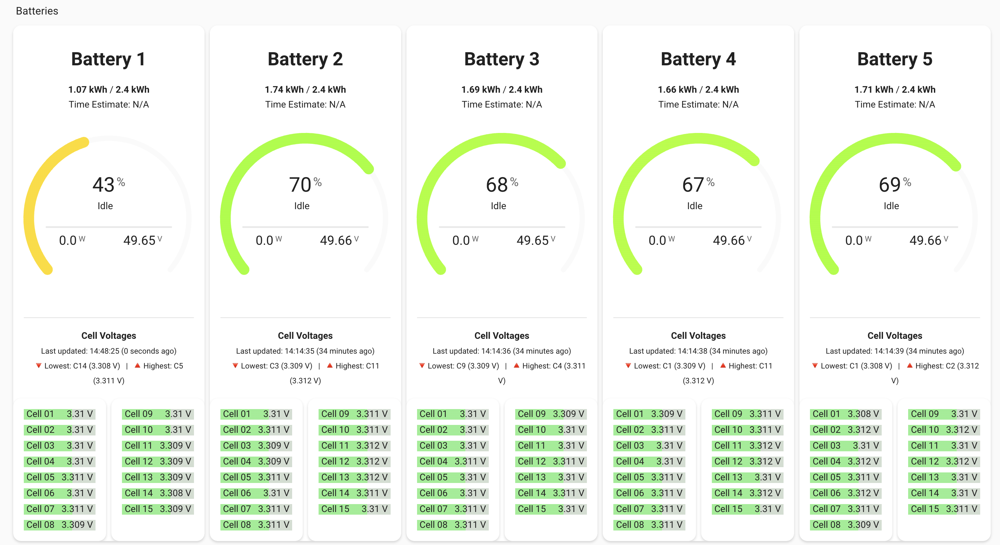

# Pylontech Extra200 to MQTT Battery Monitor for Victron

This is a python based service designed to read the data from the Pylon Extra2000 Battery (an old battery manufactuerd pre the US series) that has limited integrations to inverters via canbus etc. The program connects via the rs232 port of the master battery and collects data (e.g., voltage, current, temperature, State of Charge \[SoC\]), and publishes it to an MQTT broker. It is designed to work with the Victron ecosystem, and can be installed on a device such as a ASUS Tinkerboard or Raspberry PI next to your battery bank, and a Victron inverter running Venus OS and the [`venus-os_dbus-mqtt-battery`](https://github.com/mr-manuel/venus-os_dbus-mqtt-battery) driver to receive the data from the service.

Data returned allows for the enabling of Vicron's DVCC (Distributed Voltage and Current Control) should you wish. Note, refer to the Protection Measures & Logic (below) before enabling.

## Overview

- **Purpose**: Monitors battery parameters via serial communication and publishes them to an MQTT broker, enabling integration with Victron GX devices and Home Assistant.
- **Dependencies**: `python3` with the `pyyaml`, `paho-mqtt`, `pyserial` dependencies.
- **Installation Directory**: `/opt/extra200tomqtt` (default).

 


## Prerequisites

- Linux system with `systemd` (e.g., Ubuntu, Debian) or a Victron GX device running Venus OS. (Note this can be installed direct on your GX device, but if possible install it on a seperate device)
- Python 3.x installed.
- `pip3` for dependency management.
- Sudo privileges for installation.
- Victron inverter with Venus OS installed (e.g., Cerbo GX). Users must install the `venus-os_dbus-mqtt-battery` driver on their Victron device to process the MQTT data. (read below for details)

## What the Script Does

The `extra200tomqtt.py` script, executed via `start.sh`, performs the following:

1. **Serial Communication**: Connects to a serial BMS (e.g., via RS232, RS485, or TTL UART) to retrieve real-time battery data such as voltage, current, temperature, and SoC.
2. **Data Processing**: Parses the raw serial data into a structured format, applying logic to calculate derived values (e.g., power = voltage × current) and handle anomalies like missing or invalid readings.
3. **MQTT Publishing**: Publishes processed data to an MQTT broker using topics defined in `config.yaml` (e.g., `/battery/data`). The data is formatted as JSON for compatibility with Victron's `venus-os_dbus-mqtt-battery` driver.
4. **Logging**: Writes operational logs to `/opt/extra200tomqtt/extra200tomqtt.log` and a RAM disk at `/opt/extra200tomqtt/ramdisk/battery_monitor.log` to minimize wear on persistent storage.

## How It Works

- **Startup**: The `start.sh` script mounts a 50MB RAM disk, ensuring temporary logs are stored in memory. It then enters a loop to monitor and restart `extra200tomqtt.py` if it fails. We use a ramdisk as logs can be verbose and if you are running this on a device with EMMC like a raspberry pi this will prolong the life of the EMMC on the device.
- **Main Loop**: `extra200tomqtt.py` continuously polls the BMS, processes the data, and publishes it to MQTT. The loop includes a delay between restarts and polling the inverter (configurable in yaml) to prevent overwhelming the system.
- **Configuration**: `config.yaml` specifies serial port, baud rate, MQTT broker details, and topic structure. The script dynamically updates this file to use the RAM disk for logging.

## Protection Measures and Logic

The script includes several safety and reliability features:

1. **RAM Disk Usage**: By mounting a tmpfs at `/opt/extra200tomqtt/ramdisk`, logs are stored in volatile memory, reducing SD card wear on Victron devices and protecting against data corruption during power loss.
2. **Restart Logic**: The `monitor_script` function in `start.sh` automatically restarts the Python script if it exits (e.g., due to a BMS disconnection), with a 10-second delay to avoid rapid cycling.
3. **Error Handling**: The script logs errors (e.g., failed RAM disk mount or serial connection issues) to `extra200tomqtt.log`, allowing users to diagnose problems without interrupting operation.
4. **Resource Limits**: The 50MB RAM disk size caps memory usage, preventing the script from wearing out local EMMC.
5. **Charge Voltage Protection**: The script dynamically adjusts the maximum charge voltage (`MaxChargeVoltage`) based on SoC:
  - Below 95% SoC, it sets to 52.5V for bulk charging.
  - At or above 95% SoC, it reduces to 51.0V for float charging.
  - If a cell voltage exceeds 3.65V, charging is disabled (`AllowToCharge = 0`) to prevent overvoltage damage, triggering a `HighVoltage` alarm.

6. **Charge Current Protection**: The script limits `MaxChargeCurrent` based on SoC and temperature:
  - Above 90% SoC, it caps at 7.0A to avoid overcharging near full capacity.
  - Below 90% SoC, it scales to 80% of the battery's maximum charge current (e.g., 50A default), adjustable via `config.yaml`.
  - Below 0°C, charging is disabled, and `MaxChargeCurrent` is set to 0A, with a `LowChargeTemperature` alarm.
  - Between 0°C and 5°C, it limits to 10A; above 45°C, it also caps at 10A with a `HighChargeTemperature` alarm.

7. **Discharge Current Protection**: The script restricts `MaxDischargeCurrent` and disables discharging:
  - Below 5% SoC, discharging is blocked (`AllowToDischarge = 0`), with a `LowSoc` alarm.
  - Below 10% SoC, it limits to 10A, providing a buffer zone.
  - If a cell voltage drops below 2.5V, discharging is disabled, triggering a `LowCellVoltage` alarm.

8. **Cell Voltage and Imbalance Logic**: The script monitors individual cell voltages:
  - If the maximum cell voltage minus the minimum exceeds 0.05V and the maximum is above 3.4V, it enables balancing for the highest cell.
  - If the difference exceeds 0.1V, a `CellImbalance` alarm is set, prompting user intervention.
  - These thresholds protect against uneven wear and potential cell failure.

9. **Temperature-Based Safeguards**: The script adjusts operations based on cell temperatures:
  - Below 0°C, it disables charging and sets a `LowTemperature` alarm.
  - Above 45°C, it sets a `HighTemperature` alarm and limits charging current.

10. **Error Codes from Battery**: The script parses battery event codes (e.g., `Bat Events`, `Power Events`, `System Fault`) from the serial data, mapping them to alarms:
  - Examples include `0x1` (Overvoltage alarm), `0x8` (Low voltage alarm), and `0x800` (Discharge MOS FAIL).
  - These are logged and published to MQTT, allowing the Victron driver to adjust inverter behavior (e.g., stopping charge/discharge) and alerting users via Home Assistant.

11. **Serial Failure Threshold**: If serial communication fails 10 consecutive times, the script exits, logged as a critical error, ensuring the system doesn't continue in an unstable state, which could lead to misreported data affecting Victron control.

These measures collectively ensure the battery operates within safe limits, protects against overcharging/discharging, and provides detailed feedback for troubleshooting, making it robust enough to use with the Victron DVCC (Distributed Voltage and Current Control) if you chose for the Pylontech Extra2000's limited integration capabilities.

## Installation on Victron Inverter

To integrate with a Victron inverter:

1. Ensure your Victron GX device (e.g., Cerbo GX) is running Venus OS.
2. Install the `venus-os_dbus-mqtt-battery` driver by following its instructions (https://github.com/mr-manuel/venus-os_dbus-mqtt-battery). This typically involves SSH access, downloading the driver, and configuring it to subscribe to the MQTT topics published by this script.
3. Configure `config.yaml` in this repository to match the MQTT broker and topics expected by the Victron driver.

## Home Assistant Integration


A sample Home Assistant MQTT sensor configuration has been included in the `homeassistant/` directory to import individual battery statuses. Copy the `pylon-batteries.yaml` onto your Home Assistant server add this to your `configuration.yaml` and restart Home Assistant:

```yaml
mqtt:
  sensor: !include pylon-batteries.yaml
```

Refer to the `homeassistant/` directory for further details.




## Installation

1. Clone the repository or download the files:

   ```bash
   git clone https://github.com/ned-kelly/extra200tomqtt.git
   cd extra200tomqtt
   ```

2. Run the installation script with sudo:

   ```bash
   sudo ./install.sh
   ```

3. Verify the service is running:

   ```bash
   systemctl status extra200tomqtt.service
   ```

## Configuration

- Edit `config.yaml` in `/opt/extra200tomqtt` to adjust MQTT settings, serial port, and battery addresses.
- The RAM disk path is set to `/opt/extra200tomqtt/ramdisk` and updated dynamically in `config.yaml`.

## Usage

- The service starts automatically on boot and restarts if the script fails.
- Monitor logs with:

  ```bash
  journalctl -u extra200tomqtt.service
  cat /opt/extra200tomqtt/extra200tomqtt.log
  ```

## Uninstallation

1. Run the uninstall script with sudo:

   ```bash
   sudo ./uninstall.sh
   ```

2. Verify removal:

   ```bash
   systemctl status extra200tomqtt.service
   ls /opt/extra200tomqtt
   ```

## Contributing

Submit issues or pull requests on GitHub with details of bugs or enhancements. But pelase note i'm pretty slack on github, and generally only reply to support requests or issues if they are genuiine and i have time (i'm time poor so dont expect much). If you get stuck try and feed this link into ChatGPT or Grok before submitting an issue. **If you don't know what MQTT is, Python, or how to install a DBUS serviece on a Victron inverter this project is not for you.**

## Version History

- **June 21, 2025**: Initial release with serial monitoring, MQTT publishing, and Victron integration.